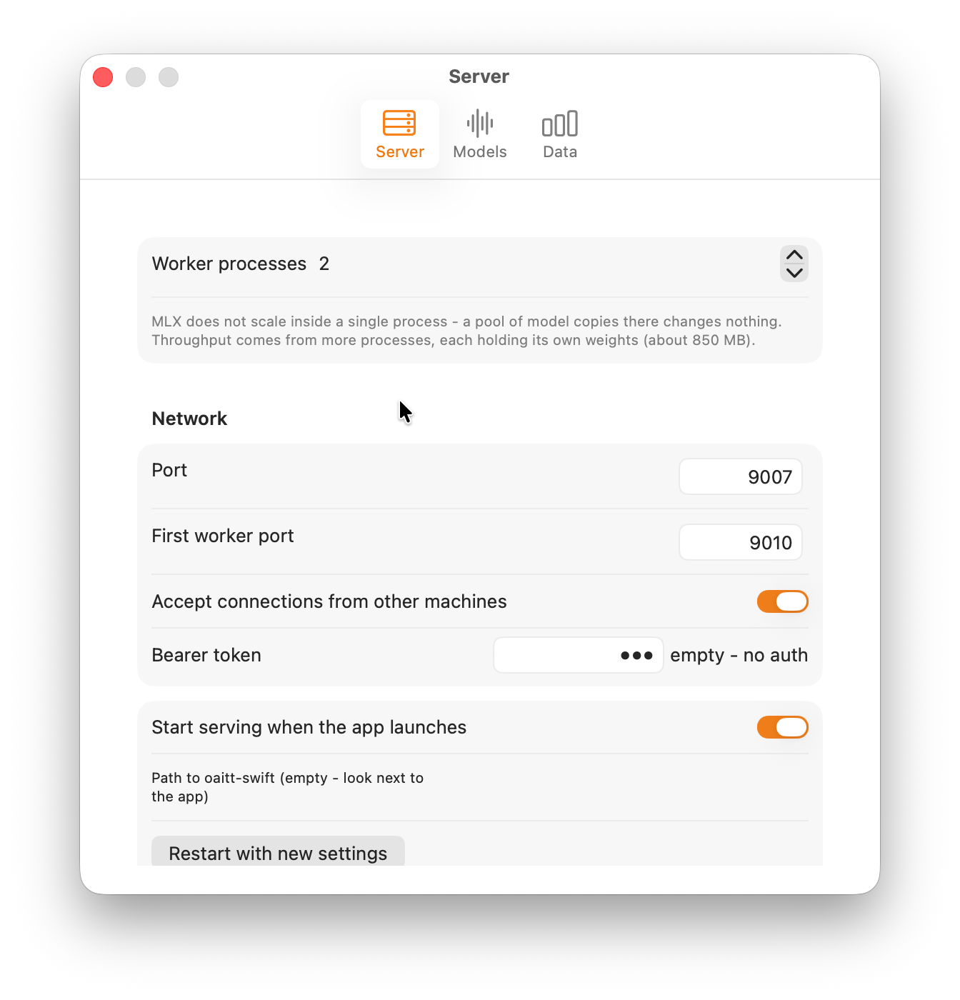
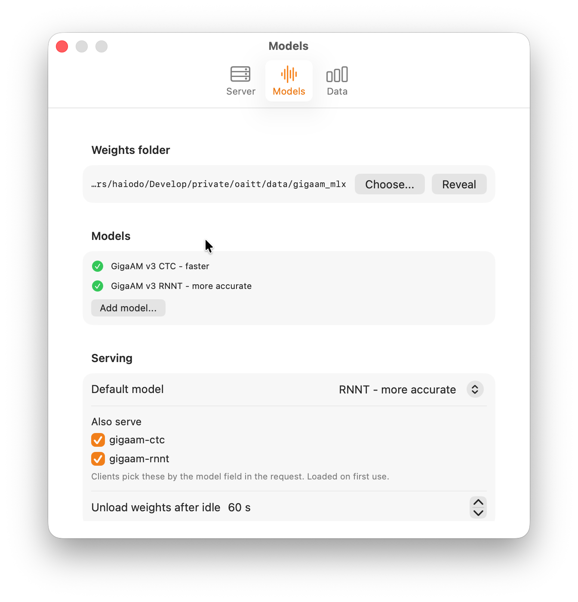
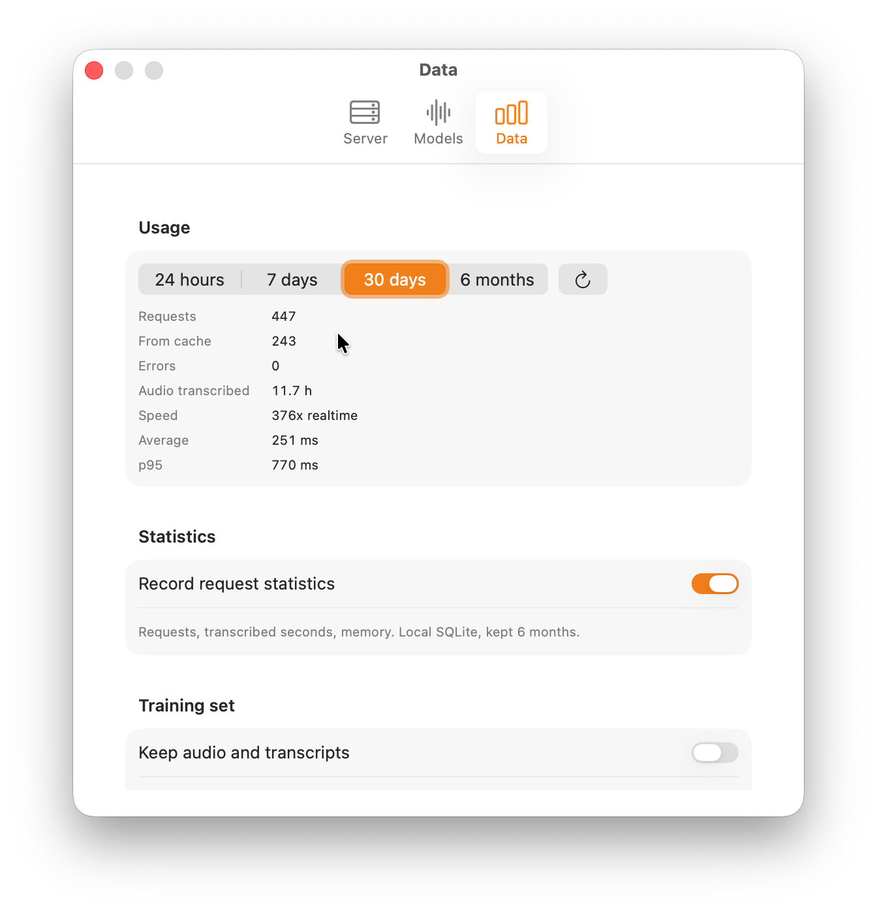

# Приложение для macOS


Нативная сборка на Swift и MLX, упакованная в приложение строки меню. Ставится одним
скачиванием: `.app` весит около 75 МБ, веса докачиваются с HuggingFace при первом запуске.

Python-версия - [python-service.md](python-service.md), устройство порта -
[swift-port.md](swift-port.md), замеры - [benchmarks.md](benchmarks.md).

## Запуск

```bash
make app-run       # собрать и запустить
make app           # только собрать, результат в swift/.build/OAITT.app
```

Приложение поднимает OpenAI-совместимый сервис на порту 9007 с токеном `key` - те же порт
и токен, что у Python-версии, то есть drop-in замена без правки конфигов у клиентов.

```bash
curl -X POST http://localhost:9007/v1/audio/transcriptions \
  -H "Authorization: Bearer key" \
  -F "file=@audio.ogg" \
  -F "response_format=verbose_json"
```

## Что показывает меню

- Состояние и адрес эндпоинта с копированием по клику.
- Строку на каждый воркер: индикатор, порт, CPU, память, время работы. Наведение мышью
  показывает pid, отвечает ли он, загружены ли веса и сколько раз перезапускался.
- Статистику за сегодня - запросы, скорость в realtime, p95 - и график запросов по
  минутам за последние полчаса.
- Кнопку **Logs**: окно с логом запросов, новыми сверху, с фильтром.

Индикатор различает три состояния, а не два: **зелёный** - воркер отвечает и держит веса,
**оранжевый** - отвечает, но веса выгружены по простою, **красный** - не отвечает. Второе
не ошибка, но первый запрос после него подождёт загрузки.

Память показывается как `phys_footprint` - то же число, что в колонке Memory у Activity
Monitor. RSS для этих процессов почти ничего не значит: веса живут в unified memory,
которую MLX выделяет через Metal, и в resident set она не попадает - `ps` показывал 40 МБ
там, где реально занято больше гигабайта.

## Настройки



**Server** - число рабочих процессов, порты, приём подключений извне, bearer-токен,
автозапуск, путь к CLI.

Воркеры именно процессами, потому что MLX не масштабируется внутри одного: пул копий
модели там не даёт ничего (143x против 144x у одной копии), рост идёт только процессами -
144x, 263x, 369x на одном, двух и четырёх. При одном воркере он обслуживает порт напрямую,
балансировщик не поднимается - лишний хоп стоил бы 30-70 мс на запрос.



**Models** - каталог весов, докачка с прогрессом, добавление своих моделей по имени
репозитория на HuggingFace, выбор модели по умолчанию, какие ещё отдавать по полю `model`,
выгрузка весов по простою.



**Data** - статистика за период, включение сбора, накопление обучающего набора и лог
запросов.

## Данные на диске

Всё лежит в `~/Library/Application Support/OAITT/`:

| | |
|---|---|
| `oaitt.sqlite` | статистика запросов, TTL 6 месяцев |
| `samples/` | аудио и расшифровки для дообучения, по умолчанию выключено, лимит 10 ГБ |
| `logs/oaitt-YYYY-MM-DD.log` | лог запросов, ротация 7 дней |
| `models/` | веса, если не указан другой каталог |

Ничего никуда не отправляется - всё остаётся на машине.

## Сборка

```bash
make swift-build   # CLI и Metal-шейдеры
make app           # бандл
make check         # формат, линтер, сборка, тесты
```

`mlx.metallib` собирается из исходников mlx-swift скриптом `swift/build-metallib.sh` -
2.7 МБ вместо 174 МБ из питоновского wheel, зависимости от venv у сборки нет.

## Ограничения

- Только Apple Silicon: MLX работает на Metal.
- Нет word-level timestamps - GigaAM их не отдаёт.
- Нет multilingual-моделей (казахский, киргизский, узбекский) - у них другая архитектура,
  порт запланирован.
- Без подписи Developer ID скачанный `.app` открывается через правый клик и с
  предупреждением.
