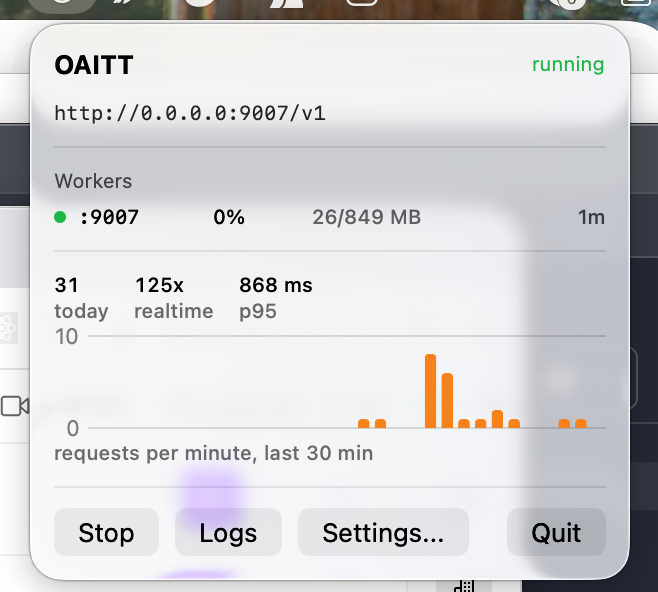

# OAITT - Open AI Transformer Transcriber

**Сервис распознавания речи на GigaAM с OpenAI-совместимым API.**

Две реализации одного API: сервис на Python и нативная сборка на Swift и MLX для Apple
Silicon, упакованная в приложение строки меню.

English: [README.en.md](README.en.md)

## Что выбрать

| | Python-сервис | Приложение для macOS |
|---|---|---|
| Где работает | macOS, Linux, Docker | только Apple Silicon |
| Установка | `make prepare && make run` | скачать `.app`, 75 МБ |
| Движки | GigaAM (PyTorch и MLX), multilingual, Whisper, WhisperX | GigaAM MLX, CTC и RNNT |
| Порт и токен | 9007, `key` | 9007, `key` - те же |
| Документация | [`docs/python-service.md`](docs/python-service.md) | [`docs/macos-app.md`](docs/macos-app.md) |

API у них одинаковый, поэтому одну можно заменить другой, не трогая клиентов.

## Быстрый старт

```bash
make            # список всех команд
make prepare    # окружение и веса GigaAM MLX
make run        # Python-сервис на 9007
make app-run    # приложение для macOS
```

```bash
curl -X POST http://localhost:9007/v1/audio/transcriptions \
  -H "Authorization: Bearer key" \
  -F "file=@audio.ogg" \
  -F "response_format=verbose_json"
```

## Приложение для macOS



Держит воркеры отдельными процессами и перезапускает упавшие, показывает живую статистику
и график запросов, пишет лог с ротацией, умеет копить датасет для дообучения. Подробности -
[`docs/macos-app.md`](docs/macos-app.md).

## Возможности

- **Восемь ASR движков**: GigaAM Native, GigaAM MLX, GigaAM Swift (CTC и RNNT), GigaAM Multilingual MLX (Apple Silicon), GigaAM via HF, Hugging Face Transformers и WhisperX
- **Пять языков**: GigaAM Multilingual - русский, английский, казахский, киргизский, узбекский.
  WER на FLEURS: 3.0% русский, 4.4% казахский, 5.6% киргизский, 7.3% узбекский
- **OpenAI-совместимый API**: Drop-in замена для OpenAI Whisper API
- **Точные временные метки**: На уровне слов (с WhisperX)
- **Метрики уверенности**: Оценка качества транскрипции
- **Адаптивные таймауты**: Защита от зависания модели
- **Apple Silicon**: Поддержка MPS для Mac
- **Множество форматов**: JSON, текст, SRT, VTT, TSV
- **Высокая производительность**: До 320x realtime с GigaAM Native на Apple Silicon

---


## Производительность

MacBook Pro M4 Max, 137.4 с аудио, `xRT` - во сколько раз быстрее реального времени.

| concurrency | CTC Python | CTC Swift | RNNT Python | RNNT Swift |
|---|---|---|---|---|
| 1 | 271x | **496x** | 105x | **142x** |
| 2 | 447x | **506x** | 201x | 150x |
| 4 | **602x** | 514x | **280x** | 150x |
| 8 | 574x | 512x | **320x** | 143x |

Swift быстрее на одном запросе и держит куда более ровную задержку - разброс p50 к max 6%
против 4.5x, - и тратит в 2.2 раза меньше unified memory. Но внутри процесса он не
масштабируется, поэтому пропускная способность там набирается процессами: 144x, 263x, 369x
на одном, двух и четырёх.

Качество на Golos после нормализации чисел: **4.38% WER** у RNNT, **5.08%** у CTC.

Полные замеры, включая проверенные и отвергнутые идеи - [`docs/benchmarks.md`](docs/benchmarks.md).

## Документация

| | |
|---|---|
| [`docs/python-service.md`](docs/python-service.md) | Python-сервис: установка, конфигурация, API, Docker |
| [`docs/macos-app.md`](docs/macos-app.md) | Приложение: запуск, настройки, данные на диске |
| [`docs/swift-port.md`](docs/swift-port.md) | Устройство Swift-порта и его ограничения |
| [`docs/benchmarks.md`](docs/benchmarks.md) | Замеры скорости и качества |
| [`docs/MEMORY_DEBUGGING.md`](docs/MEMORY_DEBUGGING.md) | Отладка утечек памяти |

План работ ведётся в трекере задач, а не здесь.

## Лицензия

MIT License

Copyright (c) 2025 Andrey Sobolev (haiodo@gmail.com)

---


## Благодарности

### GigaAM Team

Особая благодарность команде **SberDevices / Salute** за создание и открытый доступ к модели **GigaAM** — высококачественной модели распознавания русской речи:

- **Организация**: [SberDevices](https://sberdevices.ru/)
- **Репозиторий**: [github.com/salute-developers/GigaAM](https://github.com/salute-developers/GigaAM)
- **Hugging Face**: [huggingface.co/ai-sage/GigaAM-v3](https://huggingface.co/ai-sage/GigaAM-v3)
- **Лицензия**: MIT

GigaAM обеспечивает:
- Высокое качество распознавания русской речи
- Поддержку пунктуации (модели e2e)
- Высокую скорость работы (~320x realtime)
- Поддержку длинных аудио через VAD-сегментацию

### OpenAI Whisper

Благодарность команде **OpenAI** за модели Whisper, которые послужили основой для OpenAI-совместимого API.

### Hugging Face

Благодарность **Hugging Face** за библиотеку Transformers и инфраструктуру для распространения моделей.

---


## Contributing

Contributions are welcome! Please feel free to submit a Pull Request.

---

<p align="center">
  <b>OAITT</b> — Open AI Transformer Transcriber<br>
  Copyright (c) 2025 Andrey Sobolev (haiodo@gmail.com)<br>
  Made with for the speech recognition community
</p>

